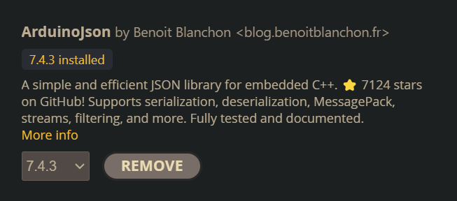

# Arduino Esp32C3 Projects
A collection of Ardiuno ESP32C3 Project. Assign to us in my 2nd year of college. This repo has a few different types of straightforward IOT Devices.

### Table of contents

* [Motivational Quotes](https://github.com/faithfel/arduino_projects?tab=readme-ov-file#motivational-quotes-from-api-esp32c3)
* [BLE RBG Color Control](https://github.com/faithfel/arduino_projects?tab=readme-ov-file#ble-rbg-color-picker-control-esp32c3)

##  Motivational Quotes From API (Esp32C3)

An Arduino Project used to display motivational quotes from an API

Zen Quotes API:
https://zenquotes.io

### Required:
In order to for ESP32C3 to deserialize the API input `Arduino Json` library is required.
Go to the Arduino IDE Libraries Tab and download this library:

## BLE RBG COLOR PICKER CONTROL (Esp32C3)
